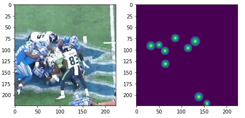

## Data preparation
The videos were split into fragments of shape **8х224х224х3**. As positive examples I chose a frame with impact and four frames before it and three after it. Using a grid with a constant step I made patches of size 224x224. As negative examples I chose random sequences of frames, which had no impacts. Also, I saved bounding boxes' positions and sizes for each sequence of frames.

## Models
From the very start, I used 3D CNN, namely **I3D** from [SlowFast](https://github.com/facebookresearch/SlowFast). The one change I made to it was adding the fourth channel in input, which was always equal one for the fifth frame (don't know whether it had any sense or not). This is the fifth frame that the model predicts bboxes for. Then I appended FPN from [pytorch_segmentation](https://github.com/qubvel/segmentation_models.pytorch) with six output channels without upsampling.

The 3d feature maps from second to fifth blocks of the backbone net were converted to 2d feature maps using `F.adaptive_avg_pool3d` and then passed to FPN. 

The FPN produced a grid of size 6x56x56. The first channel of the grid was responsible for the presence of a bbox in a particular cell of the grid. The next four channels were responsible for the position of the bbox inside a grid cell and the bbox size. The last channel predicted the presence of impact in a cell. All these predictions were made only for the fifth frame in the sequence of eight frames. Overall this grid resembles yolo output except for anchors.

## Training
### 1st stage. Training on 224x224 patches:
Augmentations:
```python
A.Compose([
            A.HorizontalFlip(p=0.5),
            A.OneOf([
                A.ColorJitter(p=1),
                A.HueSaturationValue(40, 60, 40, p=1),
                A.RGBShift(60, 60, 60, p=1),
                A.RandomGamma((20, 200), p=1)
            ], p=0.8),
            A.OneOf([
                A.GaussianBlur(p=1),
                A.GaussNoise((10.0, 50.0), p=1),
                A.MedianBlur(blur_limit=5, p=1),
                A.MotionBlur(p=1),
            ], p=0.6),
            A.ShiftScaleRotate(shift_limit=0.1, scale_limit=0.1, rotate_limit=0,
                            border_mode=0, p=0.4),
            # A.GridDistortion(p=0.2, border_mode=0),
        ])
```
#### Loss functions
I had several configurations of losses for training.
**HuberLoss** was used as a loss for bboxes position and sizes. **FocalBinaryLoss** or **`nn.BCEWithLogitsLoss`** with different pos_weight parameter were used for predicting presence of bboxes and impacts.

#### Schedule and optimizer
**Adam** with default parameters and multistage **decreasing of lr in 10 times** were used. There were ten epochs.
#### Data for training
For each epoch, I chose all the positive examples and **positive_count*2** negative examples. Starting from the second epoch **hard negative mining** was used. For this, I got predictions for all negative examples and chose those of them that had the impact confidence above some threshold (0.1). If there were not enough hard examples I added negative examples by choosing randomly.

### 2nd stage. Training on whole image
**I froze backbone** and trained only FPN on whole images of size **8x3x720x1280** for a couple of epochs. The augmentations and optimizer were the same as at stage 1.

**The ensemble of four such models** got score **0.48** on my local validation.
Then I noticed that the detection of helmet centers worked not well. It was often mistaken a shoulder protector (I don't know what exactly this thing is called) for a helmet and gave it more confidence than it gave for some helmets.
I assumed that it was because the ground truth data for bbox centers contained only points and those points were not always located in the centers of helmets so it was difficult for a model to understand where it should output points. So instead of points in the centers of bboxes I decided to predict circles with diameters equal to the average between a bbox's width and height. These circles were fading towards their boundaries. As it is shown in the picture.


I trained standalone **FPN with resnet34 as backbone** on single 224x224x3 patches and these circles as ground truth. Also, I used `nn.BCEWithLogitsLoss` as a loss (yes, you can use it for a regression task). Using such a model for predicting bboxes' centers gave a significant boost to the score, up to **0.58** on local validation.

## Predicting
There was an ensemble of **four models based on I3D**, which had been trained using different configurations, and an **ensemble of two FPN-resnet34** models for predicting bbox centers. The predictions from the models would be averaged. Including bbox positions and sizes.

For each frame in a video, I got four previous frames and three next and concatenated them into a sequence. Then I padded the image to 736x1280.  

So the input for I3D models had the size of **3x8x736x1280** and output had the size of **6x184x320**. As input for FPN-resnet34 models I used one current frame and the output of these models was **1х736х1280**, which was downsampled to 184x320. Also for predicting helmet centers I used **TTA** **scaling an image to \[0.75, 1.0, 1.25, 1.5\]** and averaging predicted values with weights \[0.3, 1.0, 0.3, 0.15\] accordingly.
Using predictions from FPN-resnet34 models for bbox centers and predictions from I3D for bbox sizes and impacts I made a list of helmets that had scores above **0.4**. Then I applied **non-maximum suppression** with parameter **0.25** to that list to get the final list of bboxes for a frame. Those bboxes that had in their center confidence of impact above **0.45** were marked as positive.

Then I applied suppression of positive bboxes of the same helmet on neighboring frames.

There were two ways. The first was to simply apply **nms** to **+/-4** frames with iou above **0.3**. Except that I used not helmet confidence but **impact confidence** as maximum values.

The second was slightly more complicated. I got one bbox with maximum impact confidence in the whole video sequence and designated this bbox as the current bbox. Then I looked for bboxes in neighboring frames in both directions that had maximum iou with this current bbox. If iou was above some thresholds I suppressed the bbox in the neighboring frame and designated this new bbox as current bbox. Then I looked for bboxes with maximum iou in next/previous frame for this new bbox. And so on up to 4 frames in both directions. If there were no bboxes with iou above the threshold I discontinued propagating suppression.

Both approaches worked the same.

## Post-processing
I used the two side view. If there was an impact in one view and there were no impacts in the other view and confidence of the impact was below **0.55** I removed this prediction of impact from the final submission.

This post-processing improves score not much, it gave just +**0.01-0.015**.
